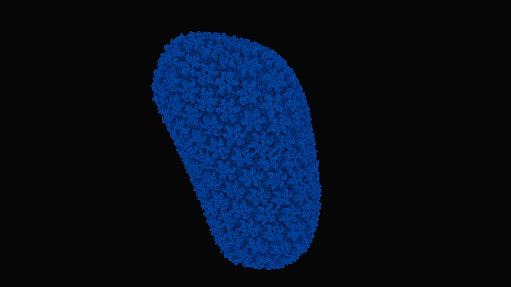
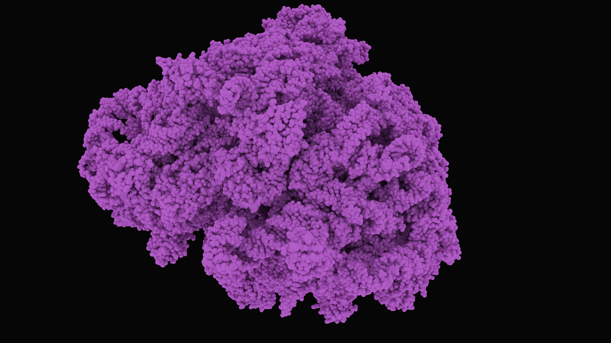

# pm

`pm` is a visualization tool for molecular files. It runs on `Linux` + `CUDA`.

`pm`'s characteristics:

- A multi-GPU interactive CUDA path tracer to visualize the 3D atomic structure of proteins and other molecules that computes full global illumination, scalable up to 64 GPUs
- A bounding volume hierarchy, for logarithmic-time ray traversals
- A handwritten parser tailored specifically for the PDB and the PDBx protein formats.
- A simple, minimal codebase written entirely in C and CUDA, for maximum performance and ease of understanding.
- Fully customizable keyboard hotkeys.
- A 5,000-word (and growing) documentation for `polymorph`'s code, as well as for molecular biology and SARS-CoV-2

## building / compiling

`make`

## running

Example.

`./pm d0/4v6t.cif`

## renders

--------------------------------------------------------------------------------------------------------------------------------
--------------------------------------------------------------------------------------------------------------------------------

#notes

## CUDA

Don't use `CUdeviceptr`! They make accessing stuff super annoying!

## PDB & PDBx/mmCIF

The atom coordindate records in the PDBx/mmCIF data distributed by the wwPDB are stored on individual lines each beginning with either 'ATOM' or 'HETATM'.
The elements of each coordinate record are white-space delimited. For example, PDBx/mmCIF coordinate records in PDB entries all have the following regular layout.

### ATOM_SITE

http://mmcif.wwpdb.org/docs/tutorials/content/atomic-description.html
http://mmcif.wwpdb.org/docs/tutorials/content/molecular-entities.html
http://mmcif.wwpdb.org/dictionaries/mmcif_pdbx_v40.dic/Categories/atom_site.html

Data items in the ATOM_SITE category record details about the atom sites in a macromolecular crystal structure, such as
the positional coordinates, atomic displacement parameters, magnetic moments and directions.
The data items for describing anisotropic atomic displacement factors are only used if the corresponding items are not given in the ATOM_SITE_ANISOTROP category.

--------------------------------------------------------------------------------------------------------------------------------
## cool sources

http://pdb101.rcsb.org/learn/guide-to-understanding-pdb-data/dealing-with-coordinates  
ftp://ftp.wwpdb.org/pub/pdb/data/structures/divided/mmCIF/  
https://zhanglab.ccmb.med.umich.edu/C-I-TASSER/2019-nCov/  
http://pdb101.rcsb.org/learn/structural-biology-highlights/sars-coronavirus-nonstructural-protein-1  

3J3Q, Atomic-level structure of the entire HIV-1 capsid:  https://www.rcsb.org/3d-view/3j3q

--------------------------------------------------------------------------------------------------------------------------------
# physics

- g-charge: gravitational charge
- e-charge: electric      charge
- s-charge: strong        charge (aka. color charge)
- w-charge: weak          charge
- spin
- isospin
- weak isospin

bosons:
  - graviton?   (QGD   field?)  (gc: `     ?? MeV/c2`; ec: `?? e`; sc: `??`; wc: `??`; spin: `2`)
  - photon      (QED   field)   (gc: `      0 MeV/c2`; ec: ` 0 e`; sc: `??`; wc: `??`; spin: `1`)
  - gluon       (QCD   field)   (gc: `      0 MeV/c2`; ec: ` 0 e`; sc: `??`; wc: `??`; spin: `1`)
  - W+ boson    (QFD   field)   (gc: ` 80,390 MeV/c2`; ec: `+1 e`; sc: `??`; wc: `??`; spin: `1`)
  - W- boson    (QFD   field)   (gc: ` 80,390 MeV/c2`; ec: `-1 e`; sc: `??`; wc: `??`; spin: `1`)
  - Z  boson    (QFD   field)   (gc: ` 91,190 MeV/c2`; ec: ` 0 e`; sc: `??`; wc: `??`; spin: `1`)
  - Higgs boson (Higgs field)   (gc: `124,970 MeV/c2`; ec: ` 0 e`; sc: `??`; wc: `??`; spin: `0`)

fermions:
  - quarks
    - gen0: `up`    (gc: `      2.2 MeV/c2`; ec: `+2/3e`; sc: `??`; wc: `??`; spin: `1/2`)  `down`    (gc: `    4.7 MeV/c2`; ec: `-1/3e`; sc: `??`; wc: `??`; spin: `1/2`)
    - gen1: `charm` (gc: `  1,280.0 MeV/c2`; ec: `+2/3e`; sc: `??`; wc: `??`; spin: `1/2`)  `strange` (gc: `   96.0 MeV/c2`; ec: `-1/3e`; sc: `??`; wc: `??`; spin: `1/2`)
    - gen2: `top`   (gc: `173,210.0 MeV/c2`; ec: `+2/3e`; sc: `??`; wc: `??`; spin: `1/2`)  `bottom`  (gc: `4,180.0 MeV/c2`; ec: `-1/3e`; sc: `??`; wc: `??`; spin: `1/2`)
  - leptons
    - gen0: `electron` (gc: `    0.5 MeV/c2`; ec: `-1 e`; sc: `??`; wc: `??`; spin: `1/2`)  `electron neutrino` (gc: `<  1.0  eV/c2`; ec: `0 e`; sc: `??`; wc: `??`; spin: `1/2`)
    - gen1: `muon`     (gc: `  105.0 MeV/c2`; ec: `-1 e`; sc: `??`; wc: `??`; spin: `1/2`)  `muon     neutrino` (gc: `<  0.2 MeV/c2`; ec: `0 e`; sc: `??`; wc: `??`; spin: `1/2`)
    - gen2: `tau`      (gc: `1,777.0 MeV/c2`; ec: `-1 e`; sc: `??`; wc: `??`; spin: `1/2`)  `tau      neutrino` (gc: `< 15.5 MeV/c2`; ec: `0 e`; sc: `??`; wc: `??`; spin: `1/2`)

proton  (gc: `938 MeV/c2`; ec: `+1 e`; sc: `??`; wc: `??`; spin: `1/2`)
neutron (gc: `939 MeV/c2`; ec: ` 0 e`; sc: `??`; wc: `??`; spin: `1/2`)

--------------------------------------------------------------------------------------------------------------------------------
--------------------------------------------------------------------------------------------------------------------------------

# molecular biology 101

--------------------------------------------------------------------------------------------------------------------------------
## data

### atoms

atom                      (nprotons, neutrons, nelectrons)
H  (hydrogen): protium    (1, 0, 1)
H  (hydrogen): deuterium  (1, 1, 1)
H  (hydrogen): tritium    (1, 2, 1)
He (helium)               (2, ?, 2)
Li (lithium)              (3, ?, 3)
Be (beryllium)            (4, ?, 4)

## aminoacids

00) ARG: MGN,CGY or CGN,AGR (arginine)  
01) HIS: (histidine)  
02) LYS: (lysine)  
03) ASP: (aspartic acid)  
04) GLU: (glutamic acid)  

05) SER: (serine)  
06) THR: (threonine)  
07) ASN: (asparagine)  
08) GLN: (glutamine)  

09) CYS: (cysteine)  
0a) SEC: (selenocysteine)  
0b) GLY: (glycine)  
0c) PRO: (proline)  

0d) ALA: GNC (alanine)  
0e) VAL: (valine)  
0f) ILE: (isoleucine)  
10) LEU: (leucine)  
11) MET: (methionine)  
12) PHE: (phenylalanine)  
13) TYR: (tyrosine)  
14) TRP: (tryptophan)  

--------------------------------------------------------------------------------------------------------------------------------
## atoms

`proton`:  uud
`neutron`: udd

By definition, atoms have *no electric charge*! This means there `nprotons` must equal `nelectrons`!
Atoms with the same number of `protons` are considered the "same element".

`ion`: an atom with nonzero electric charge (ie. `nprotons` != `nelectrons`)

atom full     radius: 100 eT-12 (picometers)
atom nucleus  radius:  10 eT-15 (femtometers)
electron      radius:   3 eT-15 (femtometers)
proton        radius:   1 eT-15 (femtometers)
neutron       radius:   1 eT-15 (femtometers)
quark         radius: 100 eT-21 (zeptometers)

`log` change of basis: `log_b[x]` equals `log[x] / log[b]`
`exp` change of basis: `exp_b[x]` equals `exp[log[b] * x]`

Fundamental automorphism of exp: `exp_b[x]` equals `exp_c[log_c[b] * x]`
Fundamental automorphism of log: `log_b[x]` equals `??`

--------------------------------------------------------------------------------------------------------------------------------
## chemistry

`covalent bond`: bond between 2 atomic nuclei by sharing electron pairs. More common in organic stuff than ionic bonds!
`ionic bond`: 
`double bond`:
`hydrogen bond`: bond between

--------------------------------------------------------------------------------------------------------------------------------
## cells

`organism`:  living entity
`life form`: living entity

`eukaryote`:  the cell nucleus is    membrane-bound, they do    have organelles
`prokaryote`: the cell nucleus isn't membrane-bound, they don't have organelles

Organelles:
  - `ribosome`:               the site of protein translation (aka synthesis)
  - `mitochondrion`:          ?
  - `chloroplast`:            ?
  - `endoplasmic recticulum`: ?
  - `Golgi apparatus`:        ?
  - `vacuole`:                ?
  - `lysosome`:               ?
  - `centrosome`:             ?

`cytoplasm`:     all the material inside the cell membrane, except for the nucleus!
`nucleoplasm`:   all the material inside the nuclear membrane

DNA damage-response pathways in the cell

--------------------------------------------------------------------------------------------------------------------------------
## proteins

`protein`:     one or more polypeptides
`peptide`:     a (single, linear) short chain of amino acids
`polypeptide`: a (single, linear)       chain of amino acids
`polymer`:     a large molecule
`biopolymer`:  a polymer produced by a `life form`
`enzyme`:      a protein that acts as a biocatalyst

A bacterium cell has ~2 million proteins
A human     cell has ~1 billion proteins
3 kinds of biopolymers:
  0) polynucleotide: chain of nucleotides, aka. DNA or RNA
  1) polypeptide:    chain of amino acids
  2) polysaccharide: chain of carbohidrates?

`protease`: an enzyme that catalyzes `proteolysis`
`proteolysis`: the decomposition of proteins (into smaller polypeptides or even single amino acids)

primary    structure: the plain (peptide?) sequence of amino acids
secondary  structure: alpha-helices and beta-sheets
ternary    structure: union of alpha-helices and beta-sheets
quaternary structure: union of ternary structures

secondary/ternary/quaternary structure can be rendered via the `Lee-Richards algorithm`

protein-drawing types:
  0) atoms:                       space filling diagrams (balls)
  1) atoms w/ bonds:              idk                    (balls w/ sticks)
  2) 2-ary/3-ary/4-ary structure: ribbon diagrams!
  3) molecular surface:           surface diagrams, solvent accessible surface area (SASA, ASA, Lee-Richards molecular surface), Shrake-Rupley rolling ball algorithm  en.wikipedia.org/wiki/Accessible_surface_area

QUESTION: How many protein-drawing types can you perform from the data in a minimal PDB file? Just the `atoms at plain balls`?

### amino acids

Made of `amine` (-NH2) and `carboxyl` (-COOH) functional groups, along with a `side chain` (R group)!

--------------------------------------------------------------------------------------------------------------------------------
## DNA/RNA

`nucleobase`: made of `atoms`,       form `nucleosides`
`nucleoside`: made of `nucleobases`, form `nucleotides`
`nucleotide`: made of `nucleosides`, form DNA

`ribose` (C5-H10-O5): a carbohydrate

`adenine`  (A, C5-N5-H5):   a `nucleobase` in the `nucleic acid` of DNA
`cytosine` (C, C4-H5-N30):  a `nucleobase` in the `nucleic acid` of DNA
`guanine`  (G, C5-H5-N50):  a `nucleobase` in the `nucleic acid` of DNA
`thymine`  (T, C5-H6-N202): a `nucleobase` in the `nucleic acid` of DNA
`uracil`   (U, C4-H4-N202): a `nucleobase` in the `nucleic acid` of DNA

AT/AU pair up.
CG pair up.

noncoding DNA
mitochondrial DNA
chloroplast DNA

`DNA polymerase`: synthesizes DNA from deoxyribonucleotides
`RNA polymerase`: synthesizes RNA from ribonucleotides

### nucleotides

made of nucleosides?

### nucleobases

made of ??

--------------------------------------------------------------------------------------------------------------------------------
## genes

gene bioprogramming:
  0) `coding`
  1) `decoding`
  2) `regulation`
  3) `expression`

`gene`:       a sequence of `nucleotides`
`nucleotide`: a `nucleoside` and a `phosphate group`.
Nucleotides are the building blocks of DNA and RNA.
Nucleotides are the building blocks of nucleic acids.

Average number of proteins coded in the genome:
  eukaryotes: 15,000
  bacteria:    3,200
  archaea:     2,400
  viruses:        42

There are 2 kinds of `life forms`: eukaryotes and prokaryotes
There are 2 kinds of `prokatyores`: `archaea` and and `bacteria`

--------------------------------------------------------------------------------------------------------------------------------
## central dogma

9 main biotransforms:

0) DNA-to-DNA:      `replication`,           https://en.wikipedia.org/wiki/DNA_replication
1) DNA-to-mRNA:     `transcription`,         https://en.wikipedia.org/wiki/Transcription_(biology)
2) DNA-to-protein:  `translation` via mRNA?

3) RNA-to-DNA:      `reverse transcription`, https://en.wikipedia.org/wiki/Reverse_transcriptase
4) RNA-to-RNA:      `replication`,           https://en.wikipedia.org/wiki/RNA-dependent_RNA_polymerase
5) mRNA-to-protein: `translation`,           https://en.wikipedia.org/wiki/Translation_(biology)

6) protein-to-DNA:     unknown!
7) protein-to-RNA:     unknown!
8) protein-to-protein: unknown!

Other operations:
  RNA `splicing`:      https://en.wikipedia.org/wiki/RNA_splicing
  RNA `interference`:  https://en.wikipedia.org/wiki/RNA_interference
  DNA repair
  RNA repair? RNA viruses? Can RNA viruses repair their RNA?

--------------------------------------------------------------------------------------------------------------------------------
## immune system

`B cell (B lymphocyte)`: a white blood cell of type lymphocyte
`T cell (T lymphocyte)`: a white blood cell of type lymphocyte
`CD8+ T cell`
`CD4+ T cell`
`cytokine`: a protein for cell signaling
`CTL`: cytotoxic T lymphocytes
`Immunoglobulin G (IgG)`: a type of antibody, a glycoprotein made of 4 polypeptide chains

--------------------------------------------------------------------------------------------------------------------------------
# sars-cov-1 genome

5 major Open Reading Frames (OFRs) that encode:
  0) replicase protein
  1) S (spike glycoprotein).
  2) E (envelope protein).
  3) M (membrane protein).
  4) N (nucleocapsid protein).

Seveal small non-structural ORFs between the S and E genes and between the M and N genes

sars-cov-1 viral protease: sars-cov 3C-like protease (3CL PRO)

**sars-cov-1 infection**: sars-cov-1 binds to a host cell via a specific SARS receptor: ACE2-2, aka. angiotensin converting enzyme 2

sars-cov-1 produces several functional proteins in infected human cells by cleaving them from its two overlapping"“polyproteins": pp1a (486 kDa) and pp1ab (790 kDa).
Papain-like protease 2 (PL2pro) and 3C-like protease (3CLpro, also referred to as the main protease, Mpro), are included among these polyproteins.
PL2pro cleaves three sites and 3CLpro cleaves 11 sites in the polyproteins to generate individual functional proteins, including an RNA-dependent RNA polymerase,
a helicase, a single-stranded RNA-binding protein, an exoribonuclease, an endoribonuclease, and a 2′-O-ribose methyltransferase.
3CLpro is a cysteine protease that is excised from polyproteins by its own proteolytic activity and forms a homodimer with one active site per subunit.
3CLpro reportedly recognizes the residues from P4 to P1 on the N-terminal side and P1′ on the C-terminal side of the cleavage sites,
based on the consensus sequences around the processing sites in the SARS-CoV polyproteins and the extensive mutagenesis analyses of the N-terminal autoprocessing site

--------------------------------------------------------------------------------------------------------------------------------
# sars-cov-2 genome

main protease: 6lu7, https://www.rcsb.org/structure/6lu7

--------------------------------------------------------------------------------------------------------------------------------
# sars-cov-2 S protein

The trimeric transmembrane spike glycoprotein is essential for entry into the cell.
The S protein contains two functional domains: a receptor binding domain, and a second domain which contains sequences that mediate fusion of the viral and cell membranes.
The S glycoprotein must be cleaved by cell proteases to enable exposure of the fusion sequences and hence is needed for cell entry.

The S protein's main function is binding to the cellular receptor (ie. ACE2 for sars-cov-1 and sars-cov-2) by the receptor binding site.
The S protein has a furin cleavage site between S1 and S2. The cleavage of the S protein is critical to reach an active conformation!

The coronavirus spike glypoprotein (S) plays a key role in the early steps of viral infection, with the S1 domain responsible for receptor binding and the S2 domain mediating membrane fusion.
In some cases, the S protein is proteolytically cleaved at the S1–S2 boundary.
In the case of the severe acute respiratory syndrome coronavirus (SARS-CoV), it has been shown that virus entry requires the endosomal protease cathepsin L;
however, it was also found that infection of SARS-CoV could be strongly induced by trypsin treatment.
Overall, in terms of how cleavage might activate membrane fusion, proteolytic processing of the SARS-CoV S protein remains unclear.

The sars-cov-2 S protein has a potential cleavage site for furin proteases

--------------------------------------------------------------------------------------------------------------------------------
# sars-cov-2 drugs

umifenovir (antiviral treamment for influenza)
cobicistat
darunavir
interferon atomization

--------------------------------------------------------------------------------------------------------------------------------
# sars-cov-2 misc

Alphaviruses encode 4 non-structural proteins (nsPs), most of which have well-understood functions in capping and membrane association (nsP1),
polyprotein processing and RNA helicase activity (nsP2) and as RNA-dependent RNA polymerase (nsP4).
The function of nsP3 has been more difficult to pin down and it has long been referred to as the more enigmatic of the nsPs.
The protein comprises three domains, an N-terminal macro domain, a central zinc-binding domain and a C-terminal hypervariable domain (HVD).
In this article, we review old and new literature about the functions of the three domains. Much progress in recent years has contributed to a picture of nsP3,
particularly through its HVD as a hub for interactions with host cell molecules, with multiple effects on the biology of the host cell at early points in infection.

sars-cov-1 fatality: 10.0%  
sars-cov-2 fatality:  0.1%  
mers-cov   fatality: 30.1%  

sars-cov-1 transmissibility (R0): 2.0 - 5.0  
sars-cov-2 transmissibility (R0): 1.4 - 2.0  
mers-cov   transmissibility (R0): <1  

sars-cov-2 properties:
  - it's is a betacoronavirus
  - it's is a positive-sense single-stranded RNA virus (one of the longest of all RNA viruses?)

Despite a high similarity with the genome sequence of SARS-CoV-1 and SARS-like CoVs, sars-cov-2 has a peculiar furin-like cleavage site in the Spike protein, lacking in the other SARS-like CoVs.
We discuss the possible functional consequences of this cleavage site in the viral cycle, pathogenicity and its potential implication in the development of antivirals.

The MERS-CoV S glycoprotein contains a furin cleavage site and is probably processed by these intracellular proteases during exit from the cell.
The virus particles are therefore ready for entry into the next cell.
In contrast, the SARS-CoV-1 S glycoprotein is uncleaved upon virus release from cells; it is likely cleaved during virus entry into a cell.

Proteolytic cleavage of the spike (NOT receptor binding) is the primary infection barrier for certain CoVs.

Replacing the wild-type MERS-CoV spike with the PDF-2180 spike produced a virus capable of generating viral transcripts in vitro but not sustained replication.

http://www.virology.ws/2020/02/13/furin-cleavage-site-in-the-sars-cov-2-coronavirus-glycoprotein/
Examination of the protein sequence of the S glycoprotein of SARS-CoV-2 reveals the presence of a furin cleavage sequence (PRRARS|V).
The CoV with the highest nucleotide sequence homology, isolated from a bat in Yunnan in 2013 (RaTG-13), does not have the furin cleavage sequence.

Because coronaviruses have error-prone RNA-dependent RNA polymerases (RdRP), mutations and recombination events frequently occur,
resulting in quasispecies diversity that is closely associated with adaptive evolution and the capacity to cause disease.

REPLICATION of SARS-CoV-1 requires PROTEOLYTIC processing of the REPLICASE POLYPROTEIN byh
  0) two viral cysteine proteases,
  1) a chymotrypsin-like protease (3CLpro),
  2) and a papain-like protease (PLpro).
There proteins are important targets for the development of antiviral that would inhibit viral REPLICATION

--------------------------------------------------------------------------------------------------------------------------------
# sars-cov-2 misc 2

4^3 codons

Since there are 4^3 nucleotide triplets to specify only twenty different amino acids, the genetic code is degenerate

There are six possible DNA reading frames (ie. six ways in which the DNA can be grouped into trinucleotides): the true coding frame, if any, and five other non-coding frames

Any section of coding DNA or mRNA can be searched to locate all possible open reading frames (ORFs), that is, regions displaying in frame start and stop codons. We can evaluate a given sequence to determine ORFs in all possible frames. A typical search identifies many ORFs for a given sequence; however, usually only one is the "true" ORF, which is actually translated into a protein. Without experimental data, it can often be difficult to identify the true ORF.

Regions of coding DNA should exhibit codon frequencies which conform to the known codon usage tables

Virus manifesto. A virus' genetic code encodes bioimplementations for
  0) replication: make copies of self (replicate genome, synthesize virion proteins/capsid)
  1) infection: mess-up host
  2) spread: go to other host cells

Humans have 2 sets of DNA?
  0) nuclear DNA; 3,000,000,000 nucleobase pairs; 2 copies per cell
  1) mitochondrial DNA; 16,569 nucleobase pairs; 100-1000 copies per cell

The therapies acting on the coronavirus itself include preventing the synthesis of viral RNA through acting on the genetic material of the virus, inhibiting virus replication through acting on critical enzymes of virus, and blocking the virus binding to human cell receptors or inhibiting the virus’s self-assembly process through acting on some structural proteins

In the fight against coronavirus, scientists have come up with three strategies for developing new drugs. 
  0) Test existing broad-spectrum anti-virals, eg. interferons, ribavirin, and cyclophilin inhibitors used to treat coronavirus pneumonia. Advantage: their metabolic characteristics, dosages, efficacy and side effects are clear as they have been approved for treating viral infections. Disadvantage: they are “broad-spectrum” and cannot kill coronaviruses in a targeted manner, and their side effects suck.
  1) Use existing molecular databases to screen for molecules that may have therapeutic effect on coronavirus. High-throughput screening makes this strategy possible, and new functions of many drug molecules can be found through this strategy, eg. the discovery of anti-HIV infection drug lopinavir/ritonavir.
  2) Develop new targeted drugs from scratch based on the genomic information and pathological characteristics of coronaviruses. Theoretically, the drugs found through these therapies would exhibit better anti-coronavirus effects, but the 
research procedure of new drug might cost years/decades.

The coronaviral proteases, papain-like protease (PLpro) and 3C-like protease (3CLpro), are attractive antiviral drug targets because they are essential for coronaviral replication

Although the primary function of PLpro and 3CLpro are to process the viral polyprotein in a coordinated manner, PLpro has the additional function of stripping ubiquitin and ISG15 from host-cell proteins to aid coronaviruses in their evasion of the host innate immune responses. Therefore, targeting PLpro with antiviral drugs may have an advantage in not only inhibiting viral replication but also inhibiting the dysregulation of signaling cascades in infected cells that may lead to cell death in surrounding, uninfected cells. 

Coronavirus (CoV) replication is a highly orchestrated process involving complex replication machineries to protect the virus genome, the largest known RNA genome, and the viral proteins from the host’s antiviral defense mechanisms 

Many of the SARS-CoV drug targets are encoded in the 5'-terminal two thirds of the genome, within the two open reading frames (ORF) that encode for the replicase or non-structural proteins (nsps)

Production of the replicase proteins is initiated by the translation of ORF1a and ORF1ab via a-1 ribosomal frame-shifting mechanism (Bredenbeek et al., 1990).
This mechanism produces two large viral polyproteins, pp1a and pp1ab, that are further processed by two virally encoded cysteine proteases (Fig. 1),
the papain-like protease (PLpro) and a 3C-like protease (3CLpro), which is sometimes referred to as main protease (Mpro).
Processing of the viral polyprotein is required for the release and maturation of 16 viral proteins (non-structural proteins or nsps) involved
in the formation of a membrane-associated, cytoplasmic enzyme complex, the replicase complex, which is responsible for directing the replication and transcription of the viral genome.

We found three coronaviruses from bat (96%, 88% and 88% for Bat-Cov RaTG13, bat-SL-CoVZXC12 and bat-SL-CoVZC45, respectively) have the 
highest genome sequence identity to SARS-CoV-2 (Fig. 1A). Moreover, as shown in Fig. 1B, Bat-Cov 
RaTG13 exhibited the closest linkage with SARS-CoV-2. These phylogenetic evidences suggest that 
SARS-CoV-2 may be evolved from bat CoVs, especially RaTG13. Among all coronaviruses from human, 
SARS-CoV (80%) exhibited the highest genome sequence identity to SARS-CoV-2. 

SARS-CoV-2 genome has 10 open reading frames (Fig. 2A). ORF1ab encodes replicase polyprotein 1ab

ORF2-ORF10 encodes viral structural proteins such as S, M, N, and E proteins, and other auxiliary proteins.
The S, M, E proteins are involved in the formation of the viral coat, and the N protein is involved in the packaging of the RNA genome

--------------------------------------------------------------------------------------------------------------------------------
# sars-cov-2 data

sars-cov-2 S glycoprotein (close)  https://www.rcsb.org/structure/6vxx
3D models                          https://zhanglab.ccmb.med.umich.edu/C-I-TASSER/2019-nCov/

global infections                  https://www.tableau.com/covid-19-coronavirus-data-resources
map                                https://coronavirus.jhu.edu/map.html

--------------------------------------------------------------------------------------------------------------------------------
# sars-cov-2 proteins

http://www.rcsb.org/structure/6vyo

--------------------------------------------------------------------------------------------------------------------------------
For example, SARS-CoV-2 enters host cells by binding to the angiotensin-converting enzyme 2 (ACE2) receptors via its highly pathogenic spike (S) glycoproteins.
Once inside, it releases its RNA, packaged in a nucleocapsid (N) phosphoprotein,
and begins assembly of a... *not-fully-understood* replicase-transcriptase complex that will mediate the synthesis of genome mRNA.
wherein two coronaviral proteases, the papain-like protease (PLpro) and the 3C-like protease, are fundamental to coronaviral replication.
This yields the spike glycoprotein, the nucleocapsid phosphoprotein, the papain-like protease, and the 3C-like protease as major targets for treatment.

The genome of the SARS-CoV-1 encodes 28 proteins that orchestrate its lifecycle of cell death.
Four of these are structural proteins on the surface of the virus, sixteen are nonstructural proteins involved in replication (named nsp1-nsp16), and the rest are a loose collection of "accessory" proteins.
Some of the nonstructural proteins have familiar functions common to many viruses,
such as a polymerase that replicates the RNA genome and proteases that cleave the viral polyproteins into functional pieces.
Others, including nsp1, play supporting roles by suppressing the normal processes of the cell and blocking the normal defenses.
Nsp1 is an attractive target for therapy since it plays a role early in infection:
it is one of the first proteins produced by the virus and it has been shown to be important for the pathogenicity of the virus.

--------------------------------------------------------------------------------------------------------------------------------
# molecular biology tools

## visualization

- Chimera
- Jmol
- OpenRasMol

## structure determination systems

- CCP4
- Phenix

--------------------------------------------------------------------------------------------------------------------------------
`DNA` is **BIOLOGICAL MACHINE CODE** encoded in base `4*4`: a 2-sided chain, where is side is in base `4` (ACGT)

Sex is encoded in the DNA, which tells us that sex has a **biological component**,
so that our sex--male or female-- is **encoded molecularly** in **every single one** of our cells,
via the nucleotide sequences that make up our chromosomes:
the chromosome pair XY for **men**, and the chromosome pair XX for **women**.

The **human genome** is the data in one set of **human chromosomes** (ie. 46 chromosomes, ~3 billion DNA base pairs)
Each cell has a copy of the human genome (ie. a copy of the 46 chromosomes)

A nucleic acid sequence is a base-4 integer that indicate the order of nucleotides forming alleles within a DNA (using GACT) or an RNA (GACU) molecule

A DNA sequence is 2 nanometers wide, but light's wavelength is in (~390nm .. ~700nm), so light itself is 2 orders of magnitude fatter! Electron's wavelength is 0.2 nanometers
A human's full DNA sequence (ie. the human genome) is 0.000000002 nanometers WIDE and 2 meters LONG!

This is how DNA folds inside the cell nucleus: youtube.com/watch?v=zBzdvhwtG5A youtube.com/watch?v=1Fyq9ul9N9Q
Chromosomes have their 'X' shape only when the cell divides!

A: Adenine  is a NUCLEOBASE in the NUCLEIC ACID of DNA  
C: Cytosine is a NUCLEOBASE in the NUCLEIC ACID of DNA  
G: Guanine  is a NUCLEOBASE in the NUCLEIC ACID of DNA  
T: Thymine  is a NUCLEOBASE in the NUCLEIC ACID of DNA  
U: Uracil   is a NUCLEOBASE in the NUCLEIC ACID of DNA  

Length of DNA in one human cell is:

  SUM length of each chromosome for each of 46 chromosomes, WHICH IS  
  0.085 meters +  
  0.083 meters +  
  0.067 meters +  
  0.065 meters +  
  0.062 meters +  
  0.058 meters +  
  0.054 meters +  
  0.050 meters +  
  0.048 meters +  
  0.046 meters +  
  0.046 meters +  
  0.045 meters +  
  0.039 meters +  
  0.036 meters +  
  0.035 meters +  
  0.031 meters +  
  0.028 meters +  
  0.027 meters +  
  0.020 meters +  
  0.021 meters +  
  0.016 meters +  
  0.017 meters +  
  0.053 meters +  
  0.020 meters, WHICH IS  
  2.104 meters

Length of DNA in one human is:  
  (length of DNA in one human cell) * (number of cells in a human), WHICH IS  
  2.104 meters * * 10,000,000,000,000, WHICH IS  
  --------------------------------  
  21,040,000,000,000 meters  

chromosome  1:  248,956,422 base pairs, 0.085 meters long  
chromosome  2:  242,193,529 base pairs, 0.083 meters long  
chromosome  3:  198,295,559 base pairs, 0.067 meters long  
chromosome  4:  190,214,555 base pairs, 0.065 meters long  
chromosome  5:  181,538,259 base pairs, 0.062 meters long  
chromosome  6:  170,805,979 base pairs, 0.058 meters long  
chromosome  7:  159,345,973 base pairs, 0.054 meters long  
chromosome  8:  145,138,636 base pairs, 0.050 meters long  
chromosome  9:  138,394,717 base pairs, 0.048 meters long  
chromosome 10:  133,797,422 base pairs, 0.046 meters long  
chromosome 11:  135,086,622 base pairs, 0.046 meters long  
chromosome 12:  133,275,309 base pairs, 0.045 meters long  
chromosome 13:  114,364,328 base pairs, 0.039 meters long  
chromosome 14:  107,043,718 base pairs, 0.036 meters long  
chromosome 15:  101,991,189 base pairs, 0.035 meters long  
chromosome 16:   90,338,345 base pairs, 0.031 meters long  
chromosome 17:   83,257,441 base pairs, 0.028 meters long  
chromosome 18:   80,373,285 base pairs, 0.027 meters long  
chromosome 19:   58,617,616 base pairs, 0.020 meters long  
chromosome 20:   64,444,167 base pairs, 0.021 meters long  
chromosome 21:   46,709,983 base pairs, 0.016 meters long  
chromosome 22:   50,818,468 base pairs, 0.017 meters long  
chromosome X:   156,040,895 base pairs, 0.053 meters long  
chromosome Y:    57,227,415 base pairs, 0.020 meters long  
ALL:          3,088,286,401 base pairs  

nucleotide: has a phosphate group, a sugar group, and a nitrogen base. 2 nucleotides form a base pair?
DNA base pair: made of 2 NUCLEOBASES bound by hydrogen bonds
gene: a chain/strand of DNA (ie. a sequence of DNA base pairs?)
DNA: made of MOLECULES called NUCLEOTIDES
allele
chromosome: a chain/strand of DNA (ie. a sequence of DNA base pair?). Each human cell has 23 chromosome pairs, ie. 46 chromosomes

chromatin fiber:

genotype  (hard attributes): an organisms's genetic data?
phenotype (soft attributes): the composite of an organism's observable attributes, ie. the organism's physical form, biological properties, and behavior. An organism's phenotype comes from: the genetic code (aka. genotype), and the environment
Karyotype:

45,X     syndrome: chromosomal disorder in ~1/5,000 females  
47,XYY   syndrome: chromosomal disorder in ~1/1,000 males  
47,XXY   syndrome: chromosomal disorder in ~1/1,000 males  
48,XXXY  syndrome: chromosomal disorder  
49,XXXXY syndrome: chromosomal disorder  
47,XXX   syndrome: chromosomal disorder in ~1/1,000 females  

cell death (cells CAN die!)

Central heterochromia

https://www.ncbi.nlm.nih.gov/books/NBK22266/#A296
Human genetic information is stored in 23 chromosomes pairs. The chromosome pair 23 has 2 special chromosomes, X and Y, that determine our sex.
Females have a pair of X chromosomes (46, XX), whereas males have one X and one Y chromosomes (46, XY).
Chromosomes are made of DNA.
Genes are special units of chromosomal DNA. Each chromosome is a very long molecule, so it needs to be wrapped tightly around proteins for efficient packaging.
Near the center of each chromosome is its CENTROMERE, a narrow region that divides the chromosome into a long arm (q) and a short arm (p).
We can further divide the chromosomes using special stains that produce stripes known as a banding pattern.
Each chromosome has a distinct BANDING PATTERN, and each BAND is numbered to help identify a particular region of a chromosome.
This method of mapping a gene to a particular band of the chromosome is called CYTOGENETIC MAPPING.
Eg. the hemoglobin beta gene (HBB) is found on chromosome 11p15.4. This means that the HBB gene lies on the short arm (p) of chromosome 11 and is found at the band labeled 15.4.
With the advent of new techniques in DNA analysis, we are able to look at the chromosome in much greater detail.
Whereas cytogenetic mapping gives a bird's eye view of the chromosome, more modern methods show DNA at a much higher resolution.
The Human Genome Project aims to identify and sequence the ~30,000 genes in human DNA.
